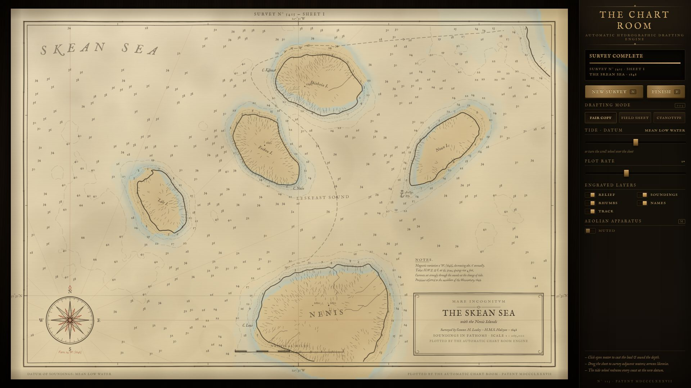
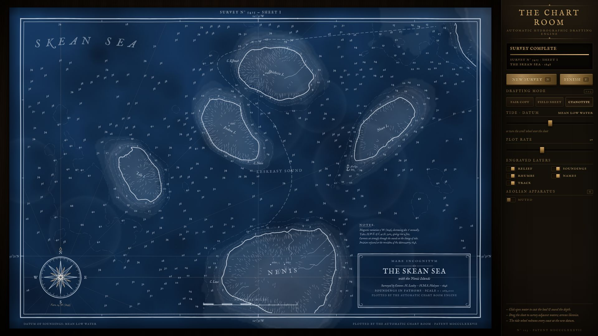

# THE CHART ROOM

*An automatic hydrographic drafting engine. It surveys seas that do not exist.*



## What this is

**The Chart Room** is a self-operating Victorian survey office that lives in your browser.
Open it and a bare sheet of rag paper is pinned to the desk. A gantry begins to move.
Over the next half minute the engine drafts a complete 19th-century nautical chart of an
ocean that has never existed — in the proper order of the trade:

1. it rules the graticule and neatline, and letters the sheet number,
2. lays red rhumb lines from the compass station,
3. tints the land and shallow-water washes,
4. scribes every coastline, traces dashed bathymetric contours and rivers,
5. hatches the relief, marks wrecks, rocks awash, kelp shoals and an anchorage,
6. sets hundreds of tiny depth soundings,
7. plots the survey ship's dated track,
8. letters every place name in an invented language,
9. constructs the compass rose, and finally engrosses the title cartouche,
   the notes block and the scale bar.

Everything on the sheet is procedural: the paper texture, the ink, the toponymy
("Cape Keva", "Leskeast Sound", "The Skean Sea"), the surveyor's name, the year, the
magnetic variation, the tide notes. There are no image assets, no data files, no APIs.
One integer seed is the entire world — and the world is infinite: drag the sheet and the
office fetches the adjacent waters as *Sheet II* of the same survey, with the same
islands keeping the same names.

## You are the surveyor

The right-hand instrument column (and the sheet itself) is the interface:

| Interaction | Effect |
| --- | --- |
| **Click open water** | Casts the lead line: a ripple, a *plop*, and the engine inks your sounding in red field ink. Click land and it stamps a triangulation station with its elevation. Your observations persist across tides, styles and sheets. |
| **Scroll wheel / tide slider** | Turns the tide datum up to ±90 ft. A ghost coastline previews the new shoreline live; when you settle, the engine re-drafts every coast, bank and sounding at the new datum. Islands drown, merge, or rise from the sea — but each keeps its name, because islands are named after their peaks and peaks outlast any tide. |
| **Drag the sheet / arrow keys** | Slides the survey to adjacent waters. Sheet number increments; the neighbouring sea gets its own name; your red observations are waiting if you come back. |
| **Drafting modes (1 / 2 / 3)** | The same survey re-inked as a **Fair Copy** (iron-gall ink and watercolour), a graphite **Field Sheet**, or a **Cyanotype** (white line-work on prussian blue). |
| **Plot rate lever, FINISH (F), NEW SURVEY (N)** | Slow the pen to a crawl, snap the sheet to completion, or reseed an entirely new ocean. |
| **Layer switches** | Relief, soundings, rhumbs, names and track can each be left off the next drafting. |
| **Aeolian Apparatus (M)** | Synthesized sound, **muted by default**: nib scratch that follows the pen's actual speed, a carriage thunk at each layer change, a lead-line plop, and the office bell when the sheet is done. All WebAudio, no samples. |

A deterministic seed can be pinned with `?seed=31415` in the URL.



## Why this concept

Given free choice, I wanted something that rewards *watching a machine work* rather than
shader spectacle — the crowded end of creative-coding demos is particle clouds, attractors
and physics toys. A chart that draws itself gives an immediate hook (the first ten seconds
are a pen laying down a world), and the surveying fiction turns every control into a
mechanic instead of a settings panel: the tide wheel is a terraforming tool, a click is a
depth measurement, a drag is an expedition. It also let me commit hard to one art
direction — iron gall, rag paper, brass and ebony — with zero stock aesthetics.

## What makes it impressive (technically)

- **A chart compiler.** The terrain (domain-warped value-noise fBm plus hashed island
  massifs on an infinite lattice) is analysed per sheet — marching-squares contours,
  flood-filled islands, flow-accumulated rivers, BFS distance fields, peak finding — and
  compiled into ~2,500 pen operations ordered like a real drafting job.
- **A plotter, not a renderer.** Ops are performed under a pixel budget per frame with a
  damped random-walk pen wobble, ink-bleed halos, letter-by-letter text reveal and
  per-layer pacing, at a steady 60 fps. The gantry cursor you see is the actual consume
  position of the op queue.
- **Stable procedural naming.** One phonology per seed; names hash from world-space
  coordinates (islands from their peaks), so identity survives tide changes and panning.
- **Cartographic layout.** The sea title arcs through the emptiest water, the compass
  rose finds its own clearing, the cartouche picks the least-land corner, labels and
  soundings negotiate space through reserved boxes.
- **Self-contained.** React + TypeScript + Vite, two bundled `@fontsource` font packages,
  zero runtime dependencies beyond React, no network calls.

## Run it

```bash
npm install
npm run dev      # → http://localhost:5173
npm run build    # type-checks, then bundles to dist/
npm run preview  # serve the production build
```

Designed for a 1920×1080 desktop display (it scales to smaller desktop windows).
Mouse, scroll wheel and keyboard; no mobile support intended.

## Research and originality

Before building, I looked briefly at what tends to be shown off in this space —
curated lists like [awesome-creative-coding](https://github.com/terkelg/awesome-creative-coding),
[Awwwards' experimental sites](https://www.awwwards.com/websites/experimental/) and studio
work such as [Lusion](https://lusion.co/), plus write-ups of Claude-built Three.js demos
(e.g. the [three.js forum showcase](https://discourse.threejs.org/t/claude-code-visualizer/91054)).
That research calibrated ambition and confirmed a direction *away* from the common
WebGL-particle genre; none of those projects' concepts, layouts, mechanics or visual
identities were used here.

I am aware that procedural fantasy-map generators exist as a genre. The Chart Room was
written from scratch for this repo — terrain model, contouring, language, plotter,
instrument fiction and all — and **does not intentionally recreate any existing app,
demo, game, or tutorial**. The premise (a live pen-plotting hydrographic office with
tide, sounding and expedition mechanics) is, to the best of my knowledge, its own thing.

---

*N° 113 · Patent MDCCCLXXXVII · Plotted by the Automatic Chart Room Engine.*
